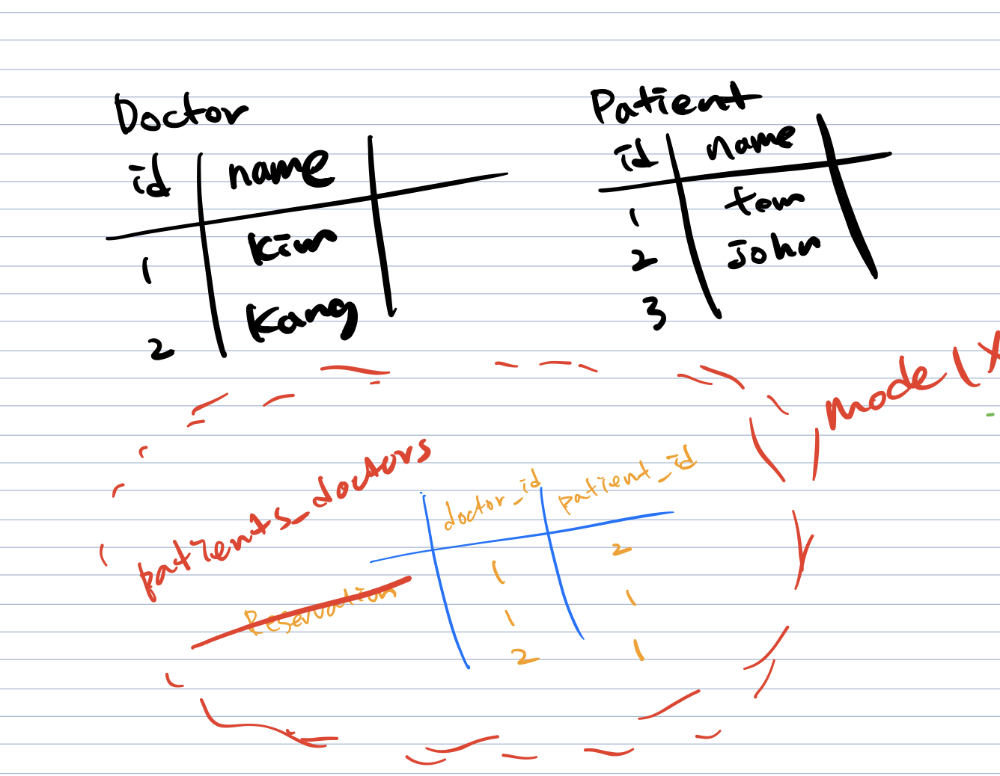

[TOC]

## Django Model Relationship Review

**Content**

1. 1:N

2. M:N

   2.1 1:N 의 한계

   2.2 추가 테이블 생성(중개 모델)

   2.3 through option

   2.4 ManyToMany

> 190416 Tue

### 1. 1:N

- 1:N 지금까지 얼마나 알고 있나 확인 해보자. 

    ```BASH
    $ python manage.py startapp onetomany
    ```

    ```PYTHON
    # settings.py
    
    INSTALLED_APPS = [
    	...
    	'onetomany',
    	...
    ]
    ```

    ```python
    from django.db import models 
    
    class User(models.Model):
    		name = models.CharField(max_length=20)
    
    class Post(models.Model):
    		title = models.CharField(max_length=20)
    		user = models.ForeignKey(User, on_delete=models.CASCADE)
    
    class Comment(models.Model):
    		content = models.CharField(max_length=20)
    		post = models.ForeignKey(Post, on_delete=models.CASCADE)
    		user = models.ForeignKey(User, on_delete=models.CASCADE)
    ```

    ```bash
    $ python manage.py makemigrations
    $ python manage.py migrate
    ```

- 혹시 없으면 깔고 설정 하자!

    ```bash
    $ pip install ipython 
    $ pip install django_extensions
    ```

    ```python
    # settings.py
    
    INSTALLED_APPS = [
    	...
    	'django_extensions',
    	...
    ]
    ```

    ```bash
    $ python manage.py shell_plus
    ```

- 쉘에서 다양한 상황을 만들기 위해 값을 추가 해보자.

    ```python
    # shell
    
    user1 = User.objects.create(name='Kim')
    user2 = User.objects.create(name='Lee')
    post1 = Post.objects.create(title='1글', user=user1)
    post2 = Post.objects.create(title='2글', user=user1)
    post3 = Post.objects.create(title='3글', user=user2)
    c1 = Comment.objects.create(content='1글1댓글', user=user1, post=post1)
    c2 = Comment.objects.create(content='1글2댓글', user=user2, post=post1)
    c3 = Comment.objects.create(content='1글3댓글', user=user1, post=post1)
    c4 = Comment.objects.create(content='1글4댓글', user=user2, post=post1)
    c5 = Comment.objects.create(content='2글1댓글', user=user1, post=post2)
    c6 = Comment.objects.create(content='!1글5댓글', user=user2, post=post1)
    c7 = Comment.objects.create(content='!2글2댓글', user=user2, post=post2)
    ```

    1. 1번 사람이 작성한 게시글은?

    ```python
    #shell
    user1.post_set 	# 이렇게 찍어보고, 전부를 가져오려면, .all()
    user1.post_set.all()
    # type은 무엇일까?
    # 쿼리셋이다.
    ```

    2. 1번 사람의 게시글별로 댓글을 출력해보자.

    ```python
    #shell
    for post in user1.post_set.all():
    	for comment in post.comment_set.all():
    		print(comment.content)
    ```

    3. 2번 댓글을 쓴 사람은?

    ```python
    # shell
    c2.user
    ```

    4. 2번 댓글을 쓴 사람의 게시글들은?

    ```python
    c2.user.post_set.all()
    ```

    5. 1번 글의 첫번째 댓글의 쓴 사람의 이름은?

    ```python
    post1.comment_set.first().user.name
    # or
    post1.comment_set.all()[0].user.name
    ```

    > `first` 와 `last` 말고는 인덱스 접근을 해야한다. 
    >
    > 그리고 이 것은 실제로 SQL에서 `LIMIT` `OFFSET` 옵션이다.

    6. 1번 글의 2번째부터 4번째까지 댓글을 가져오면? 
       그리고 이 것은 실제로 SQL에서 `OFFSET` `LIMIT`옵션이다.
       `LIMIT 3 OFFSET 1` 

    ```python
    post1.comment_set.all()[1:4]
    ```

    ```sqlite
    SELECT "manytomany_comment"."id", "manytomany_comment"."content", "manytomany_comment"."post_id", "manytomany_comm ent"."user_id" 
    FROM "manytomany_comment" WHERE "manytomany_comment"."post_id" = 1  LIMIT 3 OFFSET 1
    ```

    7. 1번 글의 두번째 댓글을 쓴 사람의 첫번째 게시물의 작성자의 이름은?

    ```python
    post1.comment_set.all()[1].user.post_set.all()[0].user.name
    ```
    8. 1번 댓글의 정보 중 user 정보만 가져온다면?

    ```python
    c = Comment.objects.values('user').get(pk=1)
    # object가 아니라 딕셔너리로 온다.
    # 다만 템플릿에서는 어짜피 딕셔너리 값도 . 을 통해 가져오기 때문에 전혀 문제가 없다.
    ```

    9. 2번 사람이 작성한 댓글을 content의 내림차순으로 가져오면?

    ```python
    user2.comment_set.order_by('-content')
    ```

    10. 1글이라는 제목인 게시글은?

    ```python
    Post.objects.filter(title='1글')
    ```

    11. 제목에 글이라는 단어가 있는 게시글은?

    ```python
    Post.objects.filter(title__contains='글')
    ```

    12. 댓글 중에 해당 글의 제목이 1글인 것은?

    ```python
    Comment.objects.filter(post__title='1글')
    ```
    13. 댓글 중에 해당 글의 제목에 1이 들어가 있는 것은?

    ```python
    Comment.objects.filter(post__title__contains='1')
    ```

    ```sqlite
    SELECT "manytomany_comment"."id", "manytomany_comment"."content", "manytomany_comment"."post_id", "manytomany_comment"."user_id" 
    FROM "manytomany_comment" INNER JOIN "manytomany_post" 
    ON ("manytomany_comment"."post_id" = "manytomany_post"."id") 
    WHERE "manytomany_post"."title" LIKE %1% ESCAPE '\'
    ```

---

### 2. M:N

- 지금까지 우리는 1:N 관계를 알아보았다.
- 여기에는 한계가 있는데, 예시를 통해 하나하나 알아보자.
- 병원에 오는 사람들을 기록하는 시스템을 만드려고 한다. 필수적인 모델은 환자와 의사이다. 어떠한 관계로 표현할 수 있을까?

#### 2.1. 1:N의 한계

- 우리가 배운 1:N으로 구현할 수 있을까? 실습을 위해 app과 model을 생성하자.

    ```bash
    $ python manage.py startapp manytomany
    ```

    ```python
    # settings.py
    INSTALLED_APPS = [
    	...
    	'manytomany',
    	...
    ]
    ```

    ```python
    # models.py
    from django.db import models
    
    class Doctor(models.Model):
    		name = models.CharField(max_length=20)
    
    class Patient(models.Model):
    		name = models.CharField(max_length=20)
    		doctor = models.ForeignKey(Doctor, on_delete=models.CASCADE)
    ```


```bash
$ python manage.py makemigrations
$ python manage.py migrate
```


- b - 다른 의사를 방문한 기록을 남길 수 없다.
- a - 남기려면 같은 tom이지만 이렇게 해야 할지도 모른다..

#### 2.2. 추가 테이블 생성 (aka 중개 모델)

- 테이블을 새로 만들자!

    

    ```python
    # models.py
    from django.db import models
    
    class Doctor(models.Model):
    		name = models.CharField(max_length=20)
    
    class Patient(models.Model):
    		name = models.CharField(max_length=20)
    
    class Reservation(models.Model):
    		doctor = models.ForeignKey(Doctor, on_delete=models.CASCADE)
    		patient = models.ForeignKey(Patient, on_delete=models.CASCADE)
    ```

    ```bash
    $ python manage.py makemigrations
    $ python manage.py migrate
    ```

- 쉘에서 확인 해보자

    ```python
    # shell
    doctor = Doctor.objects.create(name='Kim')
    patient = Patient.objects.create(name='John')
    Reservation.objects.create(doctor=doctor, patient=patient)
    ```

- 예약 정보를 찾으려면 아래와 같이 쓴다.

  ```python
  # shell
  
  doctor.reservation_set.all()
  # => <QuerySet [<Reservation: Reservation object (1)>]>
  
  patient.reservation_set.all()
  # => <QuerySet [<Reservation: Reservation object (1)>]>
  ```


- 추가로 환자 2가 진료를 받게 된다면,

    ```python
    # shell
    
    patient2 = Patient.objects.create(name='Tom')
    
    Reservation.objects.create(doctor=doctor, patient=patient2)
    # => <Reservation: Reservation object (2)>
    
    doctor.reservation_set.all()
    # => <QuerySet [<Reservation: Reservation object (1)>, <Reservation: Reservation object (2)>]>
    ```

- 환자 목록을 보고 싶다면,

    ```python
    >>> for reservation in doctor.reservation_set.all():
    ...     print(reservation.patient.name)
    ...
    'John'
    'Tom'
    ```

#### 2.3. Through option

- 근데 바로 의사의 환자들을 가져올 수 없을까? 있다! 우리가 장고에게 알려주기만 한다면 !

    ```python
    from django.db import models
    
    class Doctor(models.Model):
        name = models.CharField(max_length=20)
    
    class Patient(models.Model):
        name = models.CharField(max_length=20)
        doctors = models.ManyToManyField(Doctor, through='Reservation')
    
    class Reservation(models.Model):
        doctor = models.ForeignKey(Doctor, on_delete=models.CASCADE)
        patient = models.ForeignKey(Patient, on_delete=models.CASCADE)
    ```

    ```bash
    $ python manage.py makemigrations
    $ python manage.py migrate
    ```

    - `Reservation` 을 통해서(`through`) 가지고 오겠다!
    - `doctors` 로 **복수형**을 쓰는 이유는 일반적으로 `ManyToManyField` 는 여러개 관계니까 복수형을 쓰는 것이 convetion이다. 강제는 아니다.
    - 실제 물리적인 필드가 데이터베이스에 생겨서 `doctor_id` 를 저장해서 쓰는 것은 아니다. 어떻게 활용 되는지 보자.

    ```bash
    $ python manage.py shell_plus
    ```

    ```python
    # shell
    
    patient = Patient.objects.get(pk=1)
    patient.doctors.all()
    # => <QuerySet [<Doctor: Doctor object (1)>]>
    ```

    - 다른 의사 선생님을 추가하려고 하고 결과를 보자.

        ```python
        doctor = Doctor.objects.create(name='Hwang')
        doctor.pk
        # => 2
        
        Reservation.objects.create(doctor=doctor, patient=patient)
        # => <Reservation: Reservation object (3)>
        
        patient.doctors.all()
        # => <QuerySet [<Doctor: Doctor object (1)>, <Doctor: Doctor object (2)>]>
        ```

    - 그럼 의사 선생님 입장에서 환자 목록을 보기 위해서는 어떻게 해야할까?

        ```python
        doctor.patient_set.all()
        #=> <QuerySet [<Patient: Patient object (1)>
        ```

    

    - doctor도 `patients` 로 가져 올 수 없을까?

    ```python
    from django.db import models
    
    class Doctor(models.Model):
        name = models.CharField(max_length=20)
    
    class Patient(models.Model):
        name = models.CharField(max_length=20)
        doctors = models.ManyToManyField(Doctor, through='Reservation', related_name='patients')
    
    class Reservation(models.Model):
        doctor = models.ForeignKey(Doctor, on_delete=models.CASCADE)
        patient = models.ForeignKey(Patient, on_delete=models.CASCADE)
    ```

    ```bash
    $ python manage.py makemigrations
    $ python manage.py migrate
    ```

    - `related_name` 은 반대로 찾을 때(역참조), 어떻게 불러올 지에 대한 내용이다.
    - 기본적으로는 필수적이지 않지만, 필수적인 상황이 발생할 수 있다.

    ```bash
    $ python manage.py shell_plus
    ```

    ```python
    # shell
    
    doctor = Doctor.objects.get(pk=1)
    doctor.patients.all()
    # => <QuerySet [<Patient: Patient object (1)>, <Patient: Patient object (2)>]>
    ```

    

    - 장고에서는 이러한 모델(`Reservation` )을 **중개 모델(intermediary model)**이라고 표현한다.

#### 2.4. ManyToMany

- 이렇게 구조화 된 내용을 정말 간단하게 활용할 수 있다.

- DB와 마이그레이션 파일을 지우고 아래와 같이 변경하고 다시 반영 해보자.

    ```python
    from django.db import models
    
    class Doctor(models.Model):
        name = models.CharField(max_length=20)
    
    class Patient(models.Model):
        name = models.CharField(max_length=20)
        doctors = models.ManyToManyField(Doctor, related_name='patients')
    
    # class Reservation(models.Model):
    #     doctor = models.ForeignKey(Doctor, on_delete=models.CASCADE)
    #     patient = models.ForeignKey(Patient, on_delete=models.CASCADE)
    ```

    ```bash
    $ python manage.py makemigrations
    $ python manage.py migrate
    ```

    ```python
    #shell
    doctor = Doctor.objects.create(name='Kim')
    patient = Patient.objects.create(name='John')
    ```

    - 이제 예약 등록하려면 어떻게 해야할까?

    ```python
    # shell
    
    doctor.patients.add(patient)
    doctor.patients.all()
    # => <QuerySet [<Patient: Patient object (1)>]>
    
    patient.doctors.all()
    # => <QuerySet [<Doctor: Doctor object (1)>]>
    ```

    - 매우 직관적이게 되었다. 삭제는 어떻게 할까? 기존에는 해당하는 Reservation을 찾아서 지워야 했다면, 아래와 같이 지울 수가 있다.

    ```python
    doctor.patients.remove(patient)
    doctor.patients.all()
    # => <QuerySet []>
    
    patient.doctors.all()
    # => <QuerySet []>
    ```

    

    - 실제 DB에는 아까는 `[appname]_reservation` 테이블이였다면, 지금은 자동으로 `[appname]_patient_doctors` 로 생성되어 관리된다.
    - 그러면, 아까 배웠던 중개모델은 필요 없는 것인가?
    - 아니다! 만약 예약한 시간 정보를 담는다거나 하는 경우에는 반드시 중개모델을 만들어서 컬럼을 추가 해야한다. 다만, 그럴 필요가 없는 경우 위와 같이 해결을 할 수 있다.