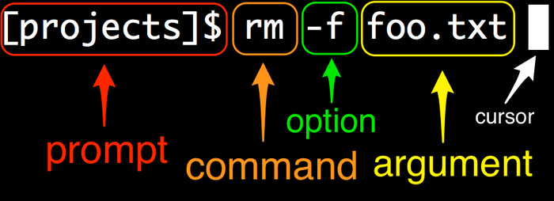

## 1. Basics

**INDEX**

1.1 Introduction

1.2 Running a terminal

1.3 Our first command

1.4 Man pages

1.5 Editing the line

1.6 Summary

---

### 1.1 Introduction

> *"In the Beginning was the Command Line." - [Neal Stephenson](https://en.wikipedia.org/wiki/Neal_Stephenson)*

* GUI : 컴퓨터 사용을 쉽게 만들었다. 컴퓨터의 대중화.

* CLI : 컴퓨터와 상호 작용하는 가장 강력하고 유연한 방법. (**The most powerful and flexible way to interact with a computer**.)

  * 사용자는 원하는 작업을 수행하도록 컴퓨터에 지시하는 명령(`commands`) 을 입력한다.

  * 이러한 명령들을 다양한 방법으로 결합하여 여러 결과를 얻을 수 있다.

  * > ```bash
    > $ rm -f foo.txt
    > ```

  * Unix command line (Linux, Android, iOS 및 macOS를 포함하는 운영 체제 제품군들) 을 기본으로 한다.

    > Windows 사용자는 [VirtualMachine](https://www.virtualbox.org/) 을 사용해 Linux 운영체제를 사용하거나, [Cloud9](https://aws.amazon.com/ko/cloud9/?origin=c9io) 같은 Cloud IDE 를 사용하는 것을 추천한다.

  * 어느 순간 반드시 Unix commands 를 알아야 하는 시점이 온다. (서버)

---

### 1.2 Running a terminal



#### 1.2.1 Prompt?

* 컴퓨터가 새로운 명령을 받아드릴 준비가 되었다는 뜻으로 보여주는 표시(Symbol). 이 표시가 떠 있을 때 명령어를 입력하여야 한다.
* 일반적으로 `$` 사인을 사용하지만, 실제 컴퓨터에 표시되는 prompt 는 매우 다양하며 customize 역시 가능하다. 여기서는 짧게 적기 위해 `$` 사인을 사용하도록 한다.

---

### 1.3 Our first command

- `$ echo`
  - 지정한 문자열 및 환경변수를 출력한다. (strandard out)
  - "echo hello" 를 프롬프트에 입력하고 Return 키를 누른다. (Enter)
  - "hello" 를 출력하고 다른 프롬프트를 return 하는 것을 볼 수 있다.

```bash
$ echo hello
hello
$
```

`''`,`""`: 작은 따옴표나 큰 따옴표는 큰 차이는 없지만 다음과 같은 차이점 정도만 알아두면 된다.

> [[Difference between single and double quotes in Bash]](https://stackoverflow.com/questions/6697753/difference-between-single-and-double-quotes-in-bash)

- `''`
  - 작은 따옴표 안에 있는 모든 문자는 문자열 그 자체로 해석된다.
- `""`
  - 변수를 사용하거나 shell 확장을 사용하려는 경우 사용한다.
  - 즉, 작은 따옴표는 아무것도 삽입하지 않지만, 큰 따옴표는 아니다. (ex. variables, backticks, certain `\` escapes, etc.)

```bash
$ MYVAR=sometext
$ echo "double $MYVAR"
double sometext

$ echo 'single $MYVAR'
single $MYVAR
```

```bash
$ echo "I'm double"
I'm double

$ echo 'it\'s my apple'
**invalid**
```

#### 1.3.1 Getting out of trouble

- `Ctrl-C`

  - 다음과 같이 명령어를 입력하다가 무언가 잘못 되었을 경우 해결할 수 있는 일반적인 방법이다.

  ```bash
  $ echo "hello, goodbye
  >
  ```

  - CLI 를 사용하다 보면 많은 문제에 빠질 수 있지만 대부분 `Ctrl-C` 로 해결할 수 있다.

  > `Ctrl-C` 가 실패하는 경우라면, 90% 확률로 `ESC` 로 해결 될 것이다.

#### 1.3.1 Exercises

1. 터미널에 `Hello, World` 를 출력해 보자.
   * 추가연습 : 따옴표를 사용하고 && 사용하지 않고 해보자.
2. `echo 'hello` 라고 입력하고 이 문제상황에서 빠져나와보자.

---

### 1.4 Man pages

> windows git bash 에서 `man` 명령어를 지원하지 않기 때문에 다음과 같은 작업이 필요하다.
>
> 1. 다음 코드를 복사한다.
>
> ```shell
> function man {
>     local section=all
>     if [[ "$1" =~ ^[0-9]+$ ]]; then section="$1"; shift; fi
>     local doc="$(curl -v --silent --data-urlencode topic="$@" --data-urlencode section="$section" http://man.he.net/ 2>&1)"
>     local ok=$?
>     local pre="$(printf '%s' "$doc" | sed -ne "/<PRE>/,/<\/PRE>/ { /<PRE>/ { n; b; }; p }")"
>     [[ $ok -eq 0 && -n "$pre" ]] && printf '%s' "$pre" | less || printf 'Got nothing.\n' >&2
>     return $ok
> }
> ```
>
> 2. ~/.bash_profile 에 내용을 넣고 저장한다.
> 3. `source ~/.bash_profile` 을 입력한다.

- `$ man`
  - `Manual` 의 줄임말
  - 우리가 사용할 수 있는 명령에 대해 자세히 알아보는 강력한 도구.

```shell
$ man echo
ECHO(1)          BSD General Commands Manual         ECHO(1)

NAME
   echo -- write arguments to the standard output

SYNOPSIS
   echo [-n] [string ...]

DESCRIPTION
   The echo utility writes any specified operands, separated by single blank
   (` ') characters and followed by a newline (`\n') character, to the stan-
   dard output.
...
:                                                                             
```

* `$ man echo` 는 `echo` 명령어의 매뉴얼 페이지이다.
* 맨 마지막의 `:` 는 "아래에 아직 정보가 더 있다" 라는 의미이며 기존의 `$` 상태와 다른 상황이다. 
  * 마우스 스크롤, 키보드 화살표키, 스페이스바,`d`, `u` 등의 키로 정보를 더 확인할 수 있다. 
  * 나오려면 `q`(종료) 를 누른다.

> 명령어의 세부 사항이 명확하지 않은 경우에 매뉴얼 페이지를 읽으면  *technical sophistication*(기술 정교성) 을 개발하는 데 도움이 될 것이다.

#### 1.4.1 Exercises

1. echo 매뉴얼을 참고하여 줄 바꿈(개행, newline) 을 하지 않고 "hello, world" 를 출력해보자.
2. `sleep` 이라고 하는 명령어의 매뉴얼 페이지를 읽고, 우리의 터미널을 5초간 재워 보자.
3. 이번에는 터미널을 100초간 재워 보고, 중간에 깨워 보도록 하자.

---

### 1.5 Editing the line

* 아래 `⌃`(Ctrl) 뒤의 알파벳은 소문자 대문자를 구분하지 않는다.

| Keybinding           | Description                                     |
| -------------------- | ----------------------------------------------- |
| `←`,  `→`            | 커서 이동                                       |
| `↑`(`⌃P`) ,`↓`(`⌃N`) | 이전(Previous) 명령어, 다음(Next) 명령어        |
| ` ⌃C`                | 현재 입력중인 작업 취소(Cancel) 이후 새 줄 실행 |
| `⌃L`  (`$ clear`)    | 터미널 깔끔하게 만들기(cLear)                   |
| `⌃A` (`fn +  ←`)     | 현재 입력중인 줄 맨 앞으로 커서 이동            |
| `⌃E` (`fn +  →`)     | 현재 입력중인 줄 맨 뒤(End)로 커서 이동         |
| `⌃U`                 | 현재 입력중인 줄 전체 삭제                      |
| `⌃W`                 | 현재 커서 기준, 단어 단위로 삭제 (Word)         |
| `⌃D` (`$ exit`)      | 터미널 및 다른 프로그램 종료                    |

---

### 1.6 Summary

- 이 챕터의 중요한 명령어 요약

| **Command**     | **Description**                                 | **Example**    |
| --------------- | ----------------------------------------------- | -------------- |
| `echo <string>` | Print string to screen                          | `$ echo hello` |
| `man <command>` | Display manual page for command                 | `$ man echo`   |
| `⌃C`            | 현재 입력중인 작업 취소(Cancel) 이후 새 줄 실행 | `$ tail ⌃C`    |
| `⌃A`            | 현재 입력중인 줄 맨 앞으로 커서 이동            |                |
| `⌃E`            | 현재 입력중인 줄 맨 뒤(End)로 커서 이동         |                |
| `⌃U`            | 현재 입력중인 줄 전체 삭제                      |                |
| Option-click    | 클릭하는 곳으로 커서 이동                       |                |
| Up & down arrow | Scroll through previous commands                |                |
| `clear` or `⌃L` | Clear screen                                    | `$ clear`      |
| `exit` or `⌃D`  | Exit terminal                                   | `$ exit`       |

#### 1.6.1 Exercises

1. `USE "man echo"` 를 있는 그대로 출력해보시오. (`Use man echo`) 가 아니다.

> 내부 문자열에 큰 따옴표를 사용하고 전체를 작은 따옴표로 묶습니다.